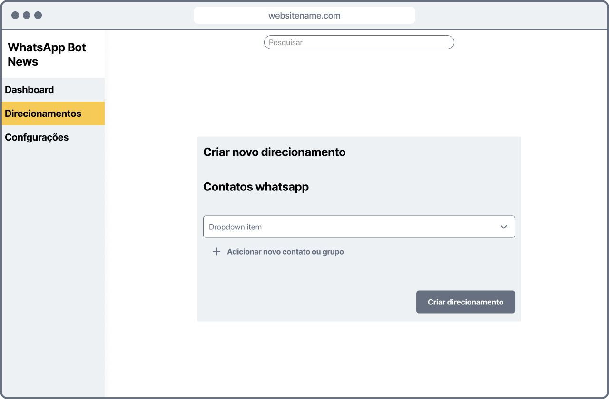

##### Projeto Integrador I

# IFPI Whatsapp Bot News

### Bot de direcionamento de notícias

---

**IFPI Whatsapp Bot News** é um bot para triagem de notícias a a partir de palavras chaves

## Equipe

- Igor Julliano
- Kaike Dias
- Kelson Eduardo

## Ferramenta de Gerenciamento do projeto

- Github Project

## *Direitos & Deveres* do usuário

### 1. O usuário deverá

- Se cadastrar
  - O número de telefone é obrigatório
  - O número de telefone deve ser verificado a cada 3 meses
- Ser administrador para direcionar notícias para um grupo
  - Para adicionar o **IFPI WhatsApp Bot News** ao grupo, você deve ser um administrador
  - O Bot somente encaminhará mensagens enquanto você se manter como administrador do grupo

### 2. O usuário poderá...

- Visualizar últimas notícias do IFPI na Tela inicial da aplicação
- Visualizar os termos (palavras chave) indexados àquelas notícias e realizar pesquisa para consulta
- Cadastrar um Direcionamento
  - Escolher termos de inclusão
  - Escolher termos de exclusão
  - Cadastrar o grupo ao qual será direcionado as notícias encontradas
- Gerenciar Direcionamentos
  - Editar, excluir, suspender, etc.

### backlog extraído a partir dos requisitos

| Acesso |    Contexto    | Descrição                               | Tipo           | Complexidade |
|:------:|:--------------:|-----------------------------------------|----------------|--------------|
| public |    Dashboard   | Acessar noticias da dashboard           | CRUD           | Baixa        |
| public |    Dashboard   | Visualizar termos indexados à notícia   | CRUD           | Baixa        |
| public |    Dashboard   | Pesquisar por notícias indexadas        | CRUD           | Média        |
| public |  Autenticação  | Login                                   | Principal      | Baixa        |
| public |  Autenticação  | Registro                                | Principal      | Baixa        |
|  user  |  Autenticação  | Verificar telefone                      | Principal      | Baixa        |
|  user  |       Bot      | Adicionar o número do bot no grupo      | Principal      | Alta         |
|  user  | Direcionamento | Criar direcionamento                    | Principal      | Alta         |
|  user  | Direcionamento | Escolher termos de inclusão             | Principal      | Baixa        |
|  user  | Direcionamento | Escolher termos de exclusão             | Principal      | Baixa        |
|  user  | Direcionamento | Gerenciar direcionamentos e seus termos | CRUD           | Média        |
|  admin | Direcionamento | Cadastrar termos impróprios             | CRUD           | Baixa        |
|  admin | Direcionamento | Gerenciar todos os direcionamentos      | Administrativo | Média        |
|  admin |  Autenticação  | Gerenciar usuários                      | Administrativo | Média        |
|   bot  |       Bot      | Algoritmo de scrap de noticias          | Principal      | Média        |
|   bot  |       Bot      | Rotina de envio de mensagens a grupos   | Principal      | Alta         |
|   bot  |       Bot      | Verificar se o usuário é admin          | Principal      | Média        |

## Prototipação

### Wireframes

#### Fluxo feliz

- ##### Entrar na aplicação (Login)

  

- ##### Visualizar pagina inicial

  

- ##### Criar um novo direcionamento (definir termos)

  

- ##### Criar um novo direcionamento (escolher contato do WhatsApp)

  

- ##### Visualizar seus direcionamentos

  
